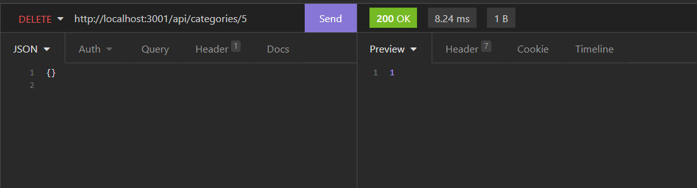
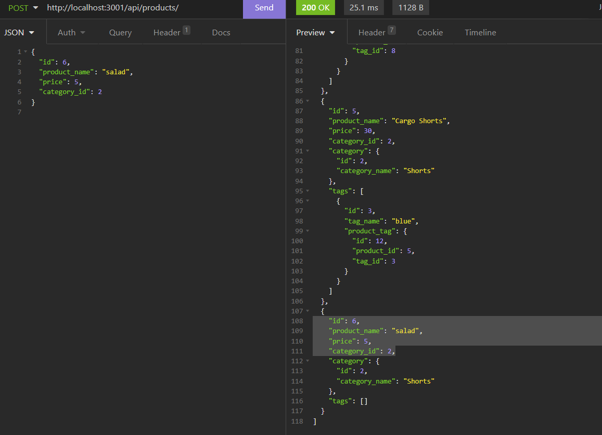

E-Commerce Back End

Internet retail, also known as e-commerce, is the largest sector of the electronics industry, generating an estimated $29 trillion in 2019. E-commerce platforms like Shopify and WooCommerce provide a suite of services to businesses of all sizes. Due to their prevalence, understanding the fundamental architecture of these platforms will benefit you as a full-stack web developer.

Purpose:
The following application is the back end tracking for an E-Commerce site. To properly use the app, you will need to have Express.js, Sequelize, MySql, and Insomnia to properly use it. 
Once the application is cloned to your local device, you will be able to Squelize your database, Seed your database, and use a local port to access the data in Insomnia to GET items by their Tag, Product id, and Catagory, in addition to POST, PUT and DELETE tested catagories.

Media:
Git Repo Link:
https://github.com/coreylevine2000/hw-13-E-Commerce-Back-End

Video Link:
https://vimeo.com/731207376/e467c8c4ad

Images:

